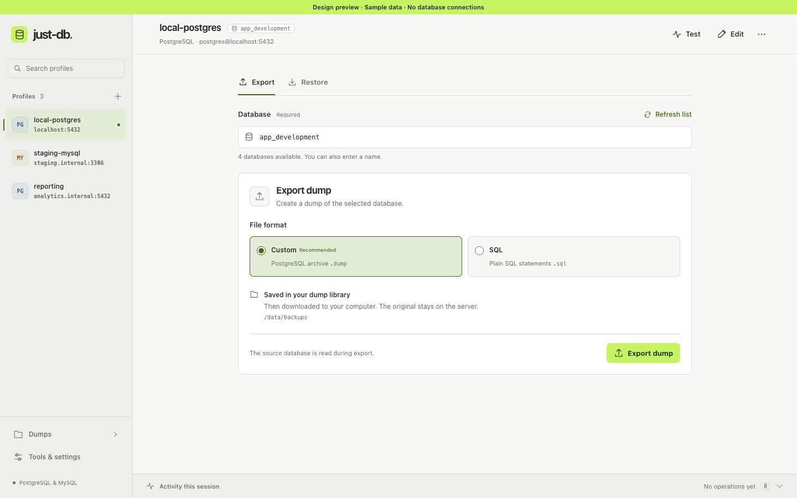
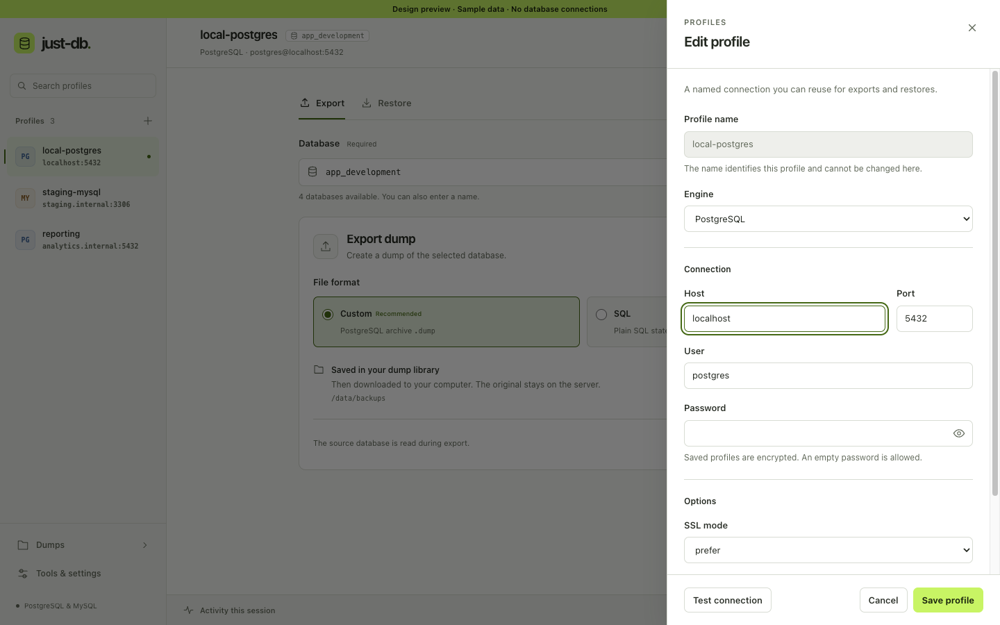
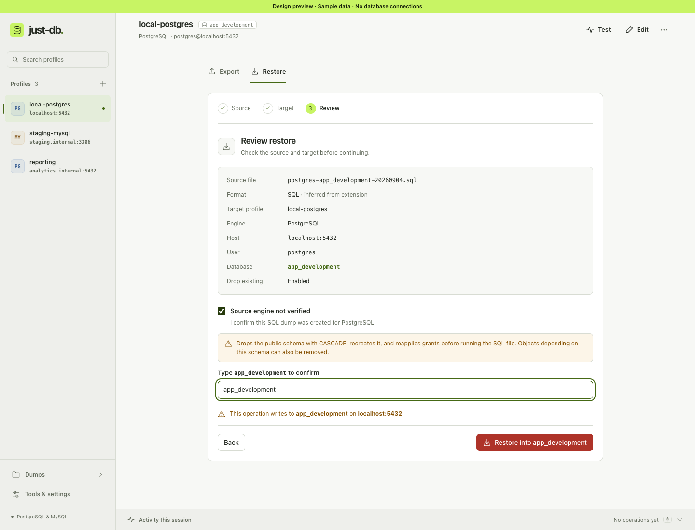

# UI guide

The web app and Wails desktop app share the same workspace. The sidebar holds connection profiles; the main area contains the selected database and operation. Dumps and Tools & settings are always available from navigation. Narrow windows use a navigation drawer.



## Profiles and databases

Use **Add profile** to open the editor. Enter an engine, endpoint, and account; the default database is optional. Testing is optional before saving. **Edit** updates the selected profile under its existing name. Creating another profile with the same name asks explicitly before replacing it. Closing an edited draft asks before discarding changes.

Select a profile, then select or type the database for this operation. This choice stays in the current session and does not change the profile's saved default. If database discovery fails, manual entry remains available. A connection test reports its own result separately from database discovery and tool availability.



## Export and restore

**Export** offers PostgreSQL custom or SQL format; MySQL/MariaDB uses SQL. The app creates the dump in its library, then starts a browser download or opens the desktop save dialog. Cancelling that dialog leaves the original dump intact. A failed copy can be retried from the result without exporting again.

**Restore** has three steps:

1. Choose a local file or a file from the dump library.
2. Choose the target profile and database, and decide whether to drop existing objects.
3. Review the exact file, engine, host, account, database, and drop behavior before submitting.

File format is inferred from the extension. SQL does not identify its source engine, so the review requires an acknowledgment that the dump belongs to the target engine. Enabling drop-existing also requires typing the exact target database name. Changing the target or options invalidates the review. Browser files are uploaded only on submission and are temporary restore inputs.



Only one export or restore can run from this UI at a time. You can navigate while it runs. The result stays attached to the target captured at submission, with elapsed time and the actual outcome. Activity keeps up to 50 completed operations in memory for the current session. It does not provide persistent jobs, percentage progress, reconnection, or cancellation.

## Files, diagnostics, and appearance

**Dumps** supports filename search, name/size/modified sorting, file details, path copying, restore, download or save-copy, and confirmed deletion. Desktop also provides **Open folder**. File records do not contain engine or source-database metadata, so the library does not claim that provenance.

**Tools & settings** shows each engine's dump, restore, and client binaries, storage paths, runtime, and version. Missing tools also appear beside affected operations. Light, dark, and system appearance are available; only the appearance preference is persisted in browser storage.

| View | Screenshot |
| --- | --- |
| Dark workspace at 960 × 720 | [Open](ui-screenshots/workspace-dark.png) |
| Dump library | [Open](ui-screenshots/dumps.png) |
| Tools & settings | [Open](ui-screenshots/settings.png) |
| Phone workspace | [Open](ui-screenshots/workspace-mobile.png) |
| First launch | [Open](ui-screenshots/first-launch.png) |

## Development preview

Run from `frontend/`:

```sh
npm install
npm run dev -- --host 127.0.0.1 --port 5174
```

Open the dev server with one of these query strings:

| Query | Fixture |
| --- | --- |
| `?preview` | Populated workspace |
| `?preview=empty` | First launch |
| `?preview=failure` | Failed discovery, connection test, download, and missing MySQL tools |
| `?preview=many` | 100 profiles and 1,000 dump files |

The preview banner identifies sample data. Preview operations use an in-memory client and make no database requests. Reloading resets the samples. Vite removes the preview client from production builds.

Production continues to use the existing HTTP/Wails adapter in `src/api.ts`. `src/app/` owns selection, request generations, operations, navigation, and appearance; `src/components/` contains shared controls and dialogs; `src/views/` renders each destination; `src/styles/` separates tokens, controls, layout, and views.

## Verification recorded on 2026-09-04

- TypeScript and the Vite production build pass.
- All 20 frontend tests pass. They cover stale responses, per-profile database choices, frozen restore payloads, SQL/drop confirmation, duplicate submissions, copy cancellation/retry, redaction, profile editing, escaping, and JSON/multipart request contracts.
- `go test ./... -count=1 -timeout 4m` passes. PostgreSQL and MySQL roundtrip tests skip because the local Docker daemon is unavailable; this run does not prove live export/restore behavior.
- Browser inspection covers both themes, populated and empty states, profile editing and discard, restore review, failure states, and layouts at 1440, 960, 768, and 390 pixels wide. The large-list fixture was inspected and filtered. At phone width the dump table scrolls inside its own container.
- The production frontend was served by the real Go HTTP server with an isolated temporary data directory. Creating, reopening, reloading, and deleting a profile worked; actual tool discovery populated settings. The deliberately unreachable test endpoint produced the expected database-list error without blocking profile storage.
- The macOS production application compiles, packages, and self-signs with Wails. Direct tagged Go compilation also passes with the explicit native-dialog framework link. Wails packaging needed system access for its macOS-version `sysctl` query. The linker warns that the Go object targets macOS 13 while Wails requests 10.13; compatibility with older macOS releases is not established by this build.

Native open/save dialogs, Finder folder opening, titlebar dragging, native theme changes, and Linux webview behavior still need runtime smoke tests. The browser fixture does not validate those behaviors. Large uploads, real database roundtrips, deployment authentication, and screen-reader/200% browser-zoom behavior also remain unverified in this pass.
